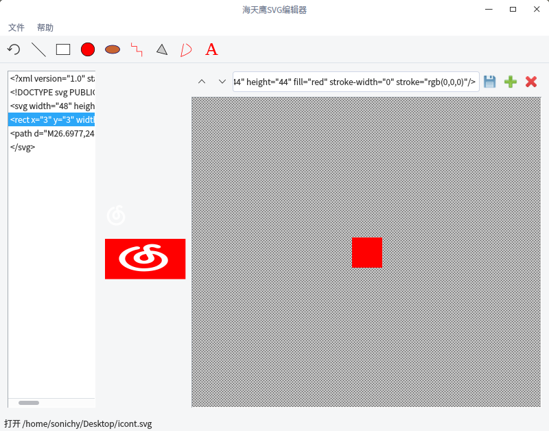

# Qt 海天鹰SVG编辑器
Linux 平台基于 Qt 的最简单的 SVG 分行查看、编辑、保存程序。  
已编译好的 HTYSVGEditor 程序适用 64 位 Linux 系统 Qt5 环境，双击运行，其他版本请自行编译。  

  

### 已知问题：  
1.只能按行查看。  

### V1.1 (2018-01-26)
* 修复打开文件不含xml、svg头引起的崩溃
* 增加拖放打开文件
* 工具栏增加 line、rect、circle、ellipse、polyline、polygon、path、text 工具，快速插入到文本框，基本的SVG元素不需要去其他地方复制，再粘贴到这里了。